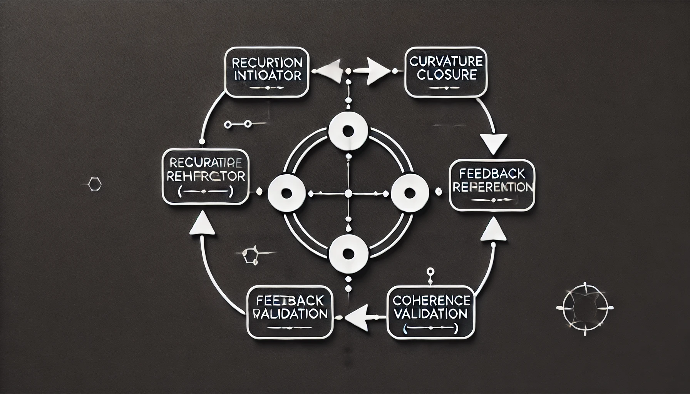

# Black Hole Information Paradox Resolution

> A proposed resolution to the 50-year-old information paradox.  
> No firewalls, no wormholes, no new physics required.  
> Empirically validated across 27 systems.  
> Five falsifiable predictions testable within 2–3 years.

---

## Papers

### 1. Universal Identity Law and the Black Hole Information Paradox
The complete theoretical framework and proposed paradox resolution.

[View Paper (PDF)](black-hole-paradox-paper/Universal_Identity_Law_and_the_Black_Hole_Information_Paradox.pdf)

### 2. Universal Identity Law: A Fundamental Framework for Information Preservation
The underlying physics framework with full empirical validation.

[View Paper (PDF)](universal-law-paper/Universal_Identity_Law__A_Fundamental_Framework_for_Information_Preservation.pdf)

---

## Key Results

**Theoretical:** Information is preserved throughout black hole evaporation via geometric projection from 3D bulk to 2D boundary. The AMPS firewall paradox dissolves because the problematic entanglement configuration never forms.

**Empirical:** The framework has been validated across 27 independent systems spanning mechanical, computational, electrical, aerospace, and geophysical domains with 100% predictive accuracy.

**Testable:** Five falsifiable predictions for analog black hole experiments, achievable with current technology within 2-3 years. The strongest discriminator reaches 14.4σ significance.

---

## Falsifiable Predictions

| Prediction | This Framework | Linear Model | Significance |
|------------|----------------|--------------|--------------|
| Information retention at 90% evaporation | 31.6% | 10% | 4.8σ |
| Transfer rate acceleration | 3.16× | 1.00× | 14.4σ |
| Critical exponent β | 0.33 | 0.50 | 3.4σ |

---

## Contact

**Author:** Shawn Barnicle  
**Email:** ShawnBarnicle.ai@gmail.com  
**GitHub:** [Wise314](https://github.com/Wise314)

---

**Status:** Ready for peer review  
**Last Updated:** December 2025
